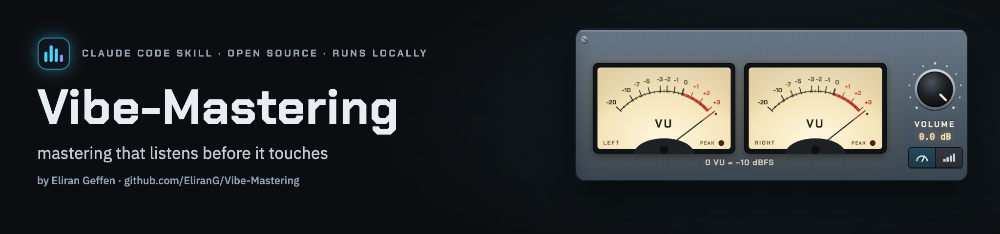
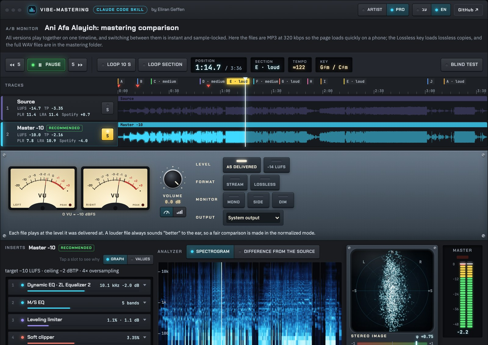
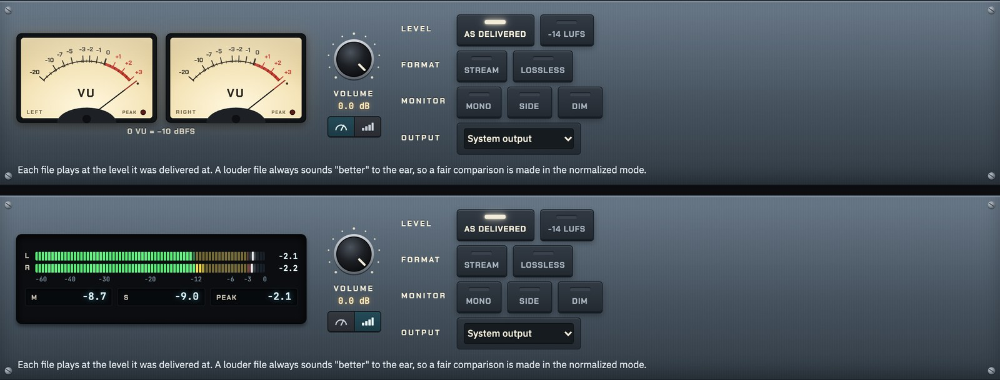
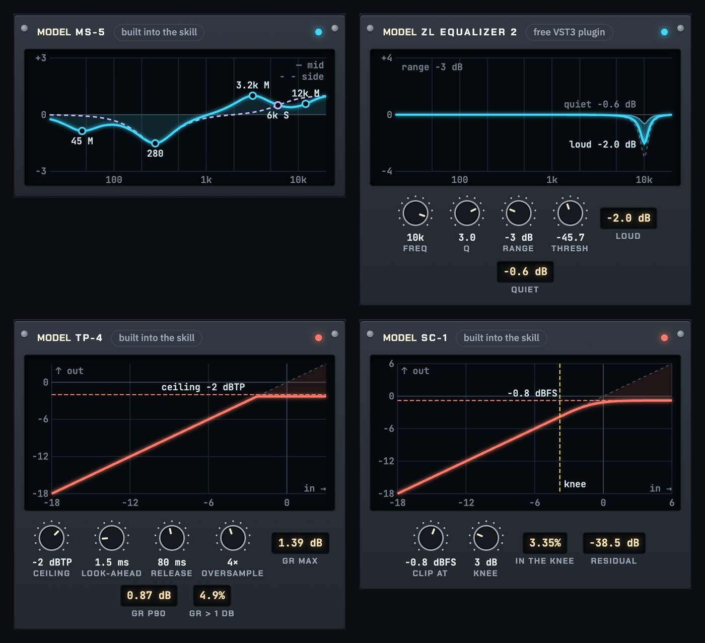
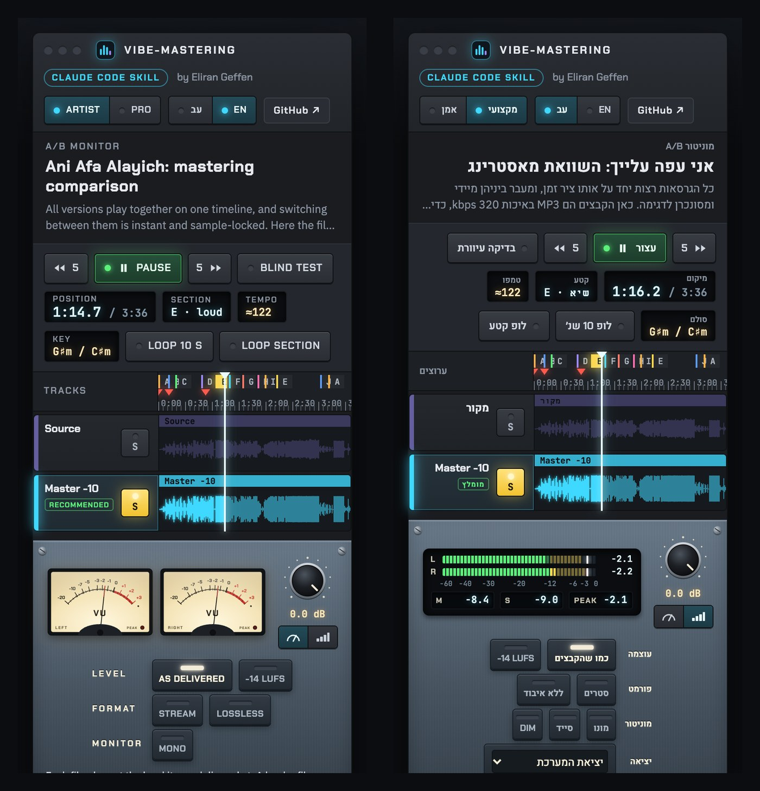
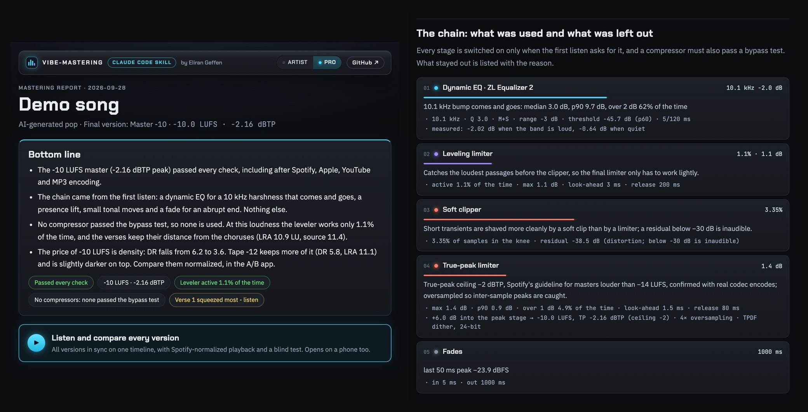
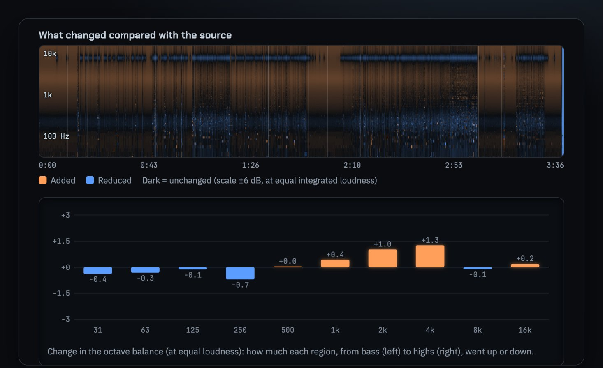

**Vibe-Mastering** is vibe coding for mastering: you say what you want in plain words, and Claude does the engineering.
This [Claude Code](https://code.claude.com) skill masters a finished song on your own computer, for free, the way a
mastering engineer works: it listens first, uses only the tools the song needs, and shows its work. You judge by ear;
the skill measures everything else.

**[Try the demo](https://claude.ai/artifact/6rpwptHxSTsYty85RDCboG)**: a real song before and after, on the A/B page
this skill builds for every master. Press play, switch versions, flip between Artist and Pro.

## Install

One line, inside Claude Code in a terminal (Claude Code 2.1.275 or later):

```
/plugin install vibe-mastering --marketplace EliranG/Vibe-Mastering
```

Claude Code asks once whether to add the marketplace (press `y`), then shows the plugin: choose where to install it.

On an older Claude Code, or straight from a shell:

```bash
claude plugin marketplace add EliranG/Vibe-Mastering
claude plugin install vibe-mastering@vibe-mastering
```

The Claude desktop app has no `/plugin` command. Run the two shell commands once in a terminal: the desktop app reads
the same settings, so the plugin shows up there too.

Then ask in plain words, in English or Hebrew, with the path to the song:

- "Master this song for Spotify: ~/Music/my-song.wav"
- "Make three versions of this track and let me compare them"
- "תעשה מאסטרינג לשיר הזה: ~/Downloads/song.wav"

## Quick start: what a run looks like

1. **One question card.** Claude asks once, at the start: the language of the pages (English, Hebrew or both with a
   switch), which versions to render (the loudest one that stays clean is recommended), any extras (an AI second
   opinion, a reference song, your own plugins) and the artist and title for the tags.
2. **It listens and plans.** It measures the song, decides which stages it needs, and predicts how hard the limiter
   works at each loudness before rendering anything.
3. **It renders and checks.** Every version is rendered in parallel, encoded to the platforms' codecs and decoded back,
   and compared with the source at equal loudness.
4. **You listen.** You get a link to the A/B page (it opens on a phone too) and a report. Compare in the -14 LUFS mode,
   check mono, pick the version by ear.
5. **You get the files.** A final folder with the 24-bit master, a 16-bit/44.1 kHz copy, an MP3 320 (tagged) and a
   release signature to render the same master again later.

The first run creates a Python environment of about 500 MB under `~/.local/share/master-song`, ffmpeg included (set
`MASTER_SONG_HOME` to put it elsewhere). Nothing is installed system-wide. To try it for one session without installing,
clone the repository, run `claude --plugin-dir path/to/Vibe-Mastering` and ask for `/vibe-mastering:vibe-mastering`.

## A tour of the A/B page



All versions play together on one timeline, sample-locked, and switching between them is instant.

- **Tracks.** One per version; S (or keys 1-9) solos it. The recommended version is marked. The ruler shows the
  sections the skill found (click to jump, loop a section) and red marks where the first listen found a possible click.
  Key and tempo are shown as estimates.
- **The monitor section**, built like a console:

  

  | Control | What it does |
  |---|---|
  | Meters: analog / digital | VU needles (0 VU = -10 dBFS), or peak bars on the IEC 60268-18 scale with momentary (M) and short-term (S) loudness in LUFS and the highest peak. On the demo song the loudness readings matched a BS.1770 measurement within 0.04 LU. |
  | Level: as delivered / -14 LUFS | Hear each version as delivered, or all at -14 LUFS the way Spotify and YouTube play them. A louder file always sounds "better", so judge in -14 LUFS. |
  | Format: Stream | Hear each master after the platform's codec (Ogg Vorbis 160 kbps), decoded and aligned to the sample. |
  | Format: Lossless | On the published link the versions load as MP3 320 for speed; this key loads lossless 16-bit copies (best on Wi-Fi). |
  | Monitor: mono / side / dim | Mono sums left and right (a phase check); side plays only what the stereo adds; dim is -20 dB. |
  | Volume, output | The knob sets the listening level; where the browser allows it, choose the output device. |

- **The inserts.** Each version's processing chain in signal order. A slot's LED and amount bar show how hard the device
  works; open it to see why it is there, and its faceplate: the curve it draws (EQ, dynamic EQ, compressor, limiter,
  clipper, tape, fades) from the same formulas the render uses, its settings as knobs, and what it measured. Pro can
  switch to the values as text. Stages that were checked and left out are listed with their reasons.

  

- **The analyzer and the stereo scope.** A spectrogram of the selected version or its difference from the source, a
  stereo scope with a phase-correlation bar, and peak meters with a clip light.
- **Blind test.** Hides the names and shuffles the order until you choose.
- **On a phone.** The tracks and the monitor keys fit on the first screen; the details come with scrolling.

  

Every page has an **Artist view** (plain words, the essentials) and a **Pro view** (every number, the analyzer, the
section table). Both show the same master; only the level of detail changes. The skill asks for English, Hebrew
(right-to-left) or both; with both, a switch changes every label without reloading the audio.

## A report in plain language



The bottom line first. Then what was used and what was left out, each with its measured reason, before and after with
the meaning of every number, the section that was squeezed most, platform and codec results, the loudness prediction,
a look at the source (earlier limiting, frequency ceiling, AI/C2PA metadata) and a glossary.



## Tips

- Compare in **-14 LUFS**, not as delivered: that is how streaming plays it, and it removes the "louder is better" bias.
- Press **Mono** on the loudest section: whatever gets quieter or hollow cancels between the channels.
- Press **Stream** on the master you like: if something changes that bothers you, the codec is where it happens.
- Use the **blind test** when two versions are close.

## How it works

1. **Listen.** Before touching anything, it measures the song: dynamic range (DR), peak-to-loudness (PSR),
   psychoacoustic sharpness (DIN 45692), harsh resonances and whether they come and go, the low end, the stereo image,
   possible clicks and signs of earlier limiting. Each finding names its evidence.
2. **Plan.** A stage is switched on only when that listen asks for it. A compressor must also pass a bypass test: the
   chain is rendered with and without it at the same loudness, and it stays only if it measurably helps. Plugins you
   own can join the chain too ([below](#use-plugins-you-already-own)), under the same rules.
3. **Predict.** The real chain runs at several loudness targets before anything is rendered, so the loudness is chosen
   by how hard the limiter works at each one, not by habit.
4. **Render.** 4x oversampling (192 kHz for a 48 kHz song), mid/side EQ, a dynamic EQ when a harsh band comes and goes,
   three-stage peak control to a -2 dBTP ceiling, and TPDF dither. Peak stages with nothing to do drop out by themselves.
5. **Check.** Every master is encoded to Ogg Vorbis, Opus, MP3 and (on macOS) AAC and decoded back, so its peaks are
   measured the way listeners get them. Mono compatibility and each platform's playback gain are checked too.
6. **Listen again.** Every version is compared with the source at equal loudness: did it get harsher, more squashed or
   less mono-safe?
7. **You decide,** by ear, on the A/B page.

**The final folder** holds only what gets released, plus `release-signature.json`: the SHA-256 of every file, the
effective settings of the render and the version of every tool and plugin involved, so the same master can be rendered
again later.

## Use plugins you already own

The VST3 plugins you bought can join the chain: a compressor or a limiter, an EQ, a saturator or a channel strip.

1. Ask in plain words, for example "use my compressor plugin in the chain" or "which plugins do I have?". The skill
   finds the VST3 plugins on the computer, reads their parameters, and runs a short test of each one without its
   window. A plugin whose licence needs its window fails in that test, before any render.
2. Each plugin gets a role:
   - **dynamics** (a compressor or a limiter): it faces the same bypass test as the skill's own compressors, and it
     stays only if it measurably helps. The report shows the numbers either way.
   - **tone** (an EQ, saturation, a channel strip): your taste, so it stays as you set it.
3. Your plugins run first, in order, at the song's own rate, with the delay and polarity they add measured and undone.
   The skill's EQ, compressors and peak control come after them, so the -2 dBTP ceiling holds whatever they do.

Behind the scenes it is a `user_plugins` list in the chain's config, with the parameter names that
`skills/vibe-mastering/scripts/plugins.py params` prints for each plugin (the names below are only an example):

```json
"user_plugins": [
  {"path": "/Library/Audio/Plug-Ins/VST3/My Compressor.vst3", "label": "My compressor", "role": "dynamics",
   "params": {"threshold_db": -18.0, "ratio": 2.0}}
]
```

Limits: VST3 only, because Audio Units hung without a window in testing. Bundles that hold many plugins in one file
are addressed by the plugin's name. So far this was tested with open-source VST3 plugins;
whether a commercial plugin's licence works without its window is exactly what the test step answers.

## Requirements

- [Claude Code](https://code.claude.com), in the terminal or in the Claude desktop app.
- [`uv`](https://docs.astral.sh/uv/) (recommended) or Python 3.10+; Python 3.12 is the tested version.
- Tested on macOS with Apple silicon. Linux should run the core chain but has not been tested; Windows is untested.
- The optional stages: [Matchering](https://github.com/sergree/matchering) (match a reference track) runs everywhere;
  [CHOWTapeModel](https://github.com/jatinchowdhury18/AnalogTapeModel) (tape warmth) and
  [ZL Equalizer](https://github.com/ZL-Audio/ZLEqualizer) (dynamic EQ) install automatically on macOS, after you agree.
  The pinned ZL Equalizer build needs Apple silicon.

## Contributing

This is an early, open project, and it opens a lot of room for new ways of working. Contributions are welcome, and
[suggestions](https://github.com/EliranG/Vibe-Mastering/issues/new?labels=enhancement) too (the A/B page links there):

- **Results on more material.** The defaults were calibrated on three AI-generated songs, pop and electronic.
  A report from another genre, or from a human-made mix, helps the most: open an issue and attach it.
- **Rules and thresholds.** Every decision rule lives in `skills/vibe-mastering/references/chain.md` (the tonal EQ in
  `eq.md`), next to the measurements behind it. A rule change should come with its evidence.
- **Linux and Windows.** Tests and fixes.
- **Commercial plugins.** Tell us which ones run in the chain without their window, and which do not.
- **Translations.** Every fixed string of the app and the report sits in one table per script.

For anything large, open an issue first. Contributions are accepted under GPL-3.0-or-later.

## Privacy and downloads

Your audio never leaves your computer. The only downloads are the Python packages from PyPI when the environment is
created (ffmpeg comes as one of them, `imageio-ffmpeg`), and, only after you agree, the two optional plugins from their
authors' GitHub releases (ChowTapeModel-Mac-2.11.4.dmg, 27 MB; ZL.Equalizer.2-1.4.0-macOS-arm64.dmg, 11 MB), checked
against pinned SHA-256 hashes. No paid API is used, and the pages carry their own fonts, so opening one contacts no server.

## Honest limits

- The skill measures; it cannot hear. Every choice comes with the numbers behind it, and the final call is made by ear.
- Its defaults were calibrated on three AI-generated songs, pop and electronic. Other material works, but may
  need a different loudness target, which the prediction step shows.
- It masters a finished stereo mix. It does not mix multitrack sessions or generate music.

## License

Made by Eliran Geffen. GPL-3.0-or-later (see `LICENSE`), because it builds on GPL libraries. Third-party components:

| Component | License | How it is used |
|---|---|---|
| [pedalboard](https://github.com/spotify/pedalboard) | GPL-3.0 | installed from PyPI |
| [Matchering](https://github.com/sergree/matchering) | GPL-3.0 | installed from PyPI |
| [mutagen](https://github.com/quodlibet/mutagen) | GPL-2.0-or-later | installed from PyPI |
| [python-soxr](https://github.com/dofuuz/python-soxr) | LGPL-2.1-or-later | installed from PyPI |
| [imageio-ffmpeg](https://github.com/imageio/imageio-ffmpeg) | BSD-2-Clause; the FFmpeg build it ships is GPL | installed from PyPI (the bundled ffmpeg) |
| numpy, scipy, numba, soundfile, pyloudnorm, matplotlib | BSD / MIT / PSF-style | installed from PyPI |
| [MoSQITo](https://github.com/Eomys/MoSQITo) | Apache-2.0 | installed from PyPI (sharpness, DIN 45692) |
| [CHOWTapeModel](https://github.com/jatinchowdhury18/AnalogTapeModel) | GPL-3.0 | optional, downloaded from its releases |
| [ZL Equalizer](https://github.com/ZL-Audio/ZLEqualizer) | AGPL-3.0 | optional, downloaded from its releases |
| Fonts: Chakra Petch, Heebo, IBM Plex Sans, IBM Plex Sans Hebrew, JetBrains Mono | SIL OFL 1.1 | bundled in `assets/fonts` (licenses beside them) and embedded into each page |

---

## בעברית

Vibe-Mastering: כמו Vibe Coding, רק למאסטרינג. אומרים במילים פשוטות מה רוצים, ו-Claude עושה את העבודה ההנדסית.
הסקיל עושה מאסטרינג לשיר גמור על המחשב שלך, בחינם, כמו שטכנאי מאסטרינג עובד: קודם מקשיב, אחר כך מפעיל רק את מה
שהשיר צריך, ומראה את כל המדידות. ההחלטה הסופית היא שלך, בהאזנה.

**[לנסות את עמוד ההדגמה](https://claude.ai/artifact/6rpwptHxSTsYty85RDCboG)**: שיר אמיתי לפני ואחרי מאסטרינג.

התקנה בשורה אחת, בתוך Claude Code בטרמינל (גרסה 2.1.275 ומעלה):

```
/plugin install vibe-mastering --marketplace EliranG/Vibe-Mastering
```

בפעם הראשונה נשאלים אם להוסיף את המרקטפלייס (מקישים y), ואז מופיע התוסף ובוחרים איפה להתקין.

בגרסה ישנה יותר, או ישירות מהטרמינל:

```bash
claude plugin marketplace add EliranG/Vibe-Mastering
claude plugin install vibe-mastering@vibe-mastering
```

באפליקציית הדסקטופ של Claude פקודת ההתקנה הזו לא זמינה. מריצים פעם אחת את שתי הפקודות בטרמינל, והתוסף מופיע גם
שם, כי האפליקציה והטרמינל קוראים את אותן הגדרות.

אחר כך פשוט מבקשים, עם הנתיב לקובץ: "תעשה מאסטרינג לשיר הזה".
השאלות נשאלות פעם אחת בהתחלה (שפה, גרסאות, תוספות, שם אמן ושיר), ומשם הכול רץ לבד עד הדפים המוכנים:

- כמה גרסאות עוצמה, ובדיקת שיאים אחרי קידוד אמיתי לספוטיפיי, אפל, יוטיוב ו-MP3
- עמוד השוואה מסונכרן עם מוניטור בסגנון קונסולה: מדי VU או מד דיגיטלי, מצב מנורמל כמו בספוטיפיי, האזנה אחרי קידוד,
  האזנה ללא איבוד, מונו וסייד, בדיקה עיוורת, ומה נכנס לכל גרסה ולמה, עם גרף לכל יחידה
- קבצי הפצה ודוח בשפה פשוטה, בעברית, באנגלית או בשתיהן, בתצוגת אמן או בתצוגה מקצועית
